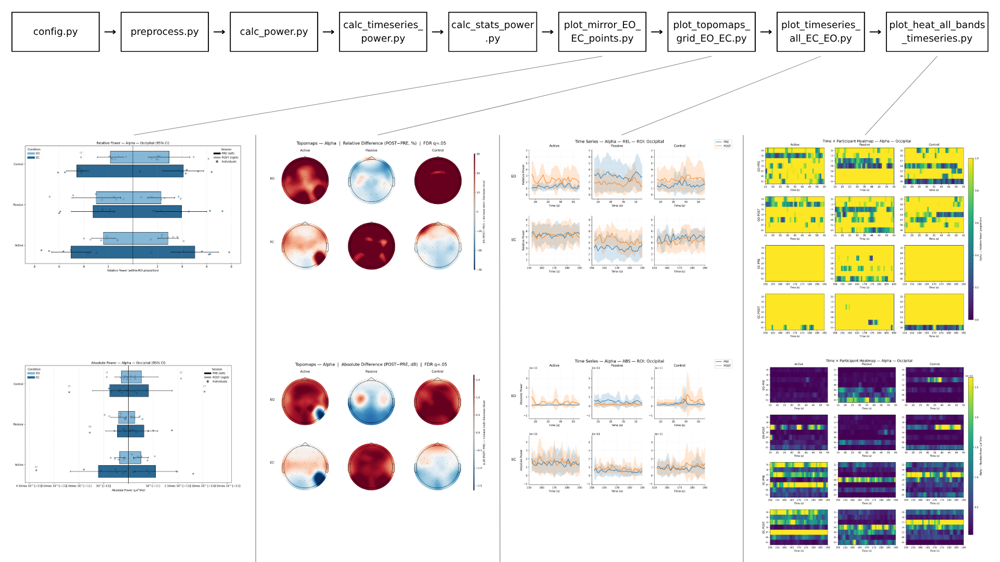

# PYPELINE-EEG

A complete pipeline to **preprocess**, **quantify**, and **visualize** EEG power in studies with **customizable** sessions and experimental conditions.
Inputs follow BIDS; outputs are publication-ready CSVs and figures.



---

## Repository layout

```
.
├─ code/
│  ├─ preprocess.py                         # BIDS-aware preprocessing for BrainVision
│  ├─ calc_power.py                         # builds wide power tables (ABS/REL)
│  ├─ calc_timeseries_power.py              # time-series data assembly
│  ├─ plot_timeseries_all_EC_EO.py          # visualization: time-series per band × ROI
│  ├─ plot_topomaps_grid_EO_EC.py           # visualization: topographic grids
│  ├─ plot_heat_all_bands_timeseries.py     # visualization: heatmaps of temporal power by band
│  ├─ plot_mirror_EO_EC_points.py           # visualization: mirror/bar/point plots
│  ├─ calc_stats_power.py                   # minimal paired stats from wide power tables
│  └─ config.py                             # parameters and paths
├─ data/                                    # BIDS input
│  └─ sub-XX[/ses-YY]/eeg/*.vhdr + .eeg + .vmrk (+ .json)
├─ results/                                 # derivatives (generated)
│  ├─ processed/                            # preprocessed FIFs (concat, EO, EC + manifest)
│  ├─ power/                                # wide power tables (abs/rel)
│  ├─ timeseries/                           # per-ROI×band temporal data
│  └─ plots/                                # figures and CSVs
├─ assets/
│  └─ steps.png
├─ requirements.txt
└─ LICENSE.txt
```

> **Note**: `config.py` lives in `code/`. Scripts import it as `import config` when run from the project root (e.g., `python code/preprocess.py`).

---

## Installation

- **Python 3.9+** (3.12 recommended)
- From the **project root**, install pinned dependencies:

```bash
# (optional) create a virtual environment
python -m venv .venv
source .venv/bin/activate  # Windows: .venv\Scripts\activate

# install exact versions
pip install -r requirements.txt
```

> Using `requirements.txt` guarantees the versions used in the paper’s analyses.

---

## Data (BIDS)

**Expected input under `data/`:**
```
data/
├─ sub-01/
│  ├─ ses-pre/
│  │  └─ eeg/
│  │     ├─ sub-01_ses-pre_task-rest_eeg.vhdr
│  │     ├─ sub-01_ses-pre_task-rest_eeg.eeg
│  │     └─ sub-01_ses-pre_task-rest_eeg.vmrk
│  └─ ses-post/
│     └─ eeg/
│        └─ sub-01_ses-post_task-rest_eeg.vhdr ...
└─ sub-02/ ...
```

> Each `.vhdr` **must** correctly reference its `.eeg`/`.vmrk`. 

---

## Configuration (`code/config.py`)

`config.py` is inside `code/`. Because of that, `PROJECT_ROOT` should be the **parent of `code/`**:

```python
from pathlib import Path

SCRIPT_PATH   = Path(__file__).resolve()
PROJECT_ROOT  = SCRIPT_PATH.parent.parent      # <- repo root
DATA_DIR      = PROJECT_ROOT / "data"
RESULTS_DIR   = PROJECT_ROOT / "results"
PLOTS_DIR     = RESULTS_DIR / "plots"
POWER_DIR     = RESULTS_DIR / "power"
TS_DIR        = RESULTS_DIR / "timeseries"
PROCESSED_DIR = RESULTS_DIR / "processed"
```

Other key settings you will likely edit:

- **Filtering / PSD**
  ```python
  FILTER_LOW = 0.5
  FILTER_HIGH = 50.0
  NOTCH_HZ = 60        # (50 in EU)

  WELCH_SEG_SEC = 4.0
  WELCH_OVERLAP = 0.5
  PSD_FMIN      = 0.5
  PSD_FMAX      = 50.0
  ```

- **Blocks (EO/EC)** used for segmentation during preprocessing (seconds):
  ```python
  BLOCKS_WITH_STATE = [
      ("EO", (15, 135)),
      ("EC", (150, 270)),
      ("EO", (285, 405)),
      ("EC", (420, 540)),
  ]
  ```

- **Bands**
  ```python
  BANDS = {
      "Delta": (0.1, 3.5),
      "Theta": (4.0, 7.9),
      "Alpha": (8.0, 12.9),
      "Beta":  (13.0, 30.0),
      "Gamma": (30.1, 50.0),
  }
  ```

- **Groups & ordering**
  ```python
  GROUP_ACTIVE  = {'01','05','07','10','15','16','19'}
  GROUP_PASSIVE = {'03','04','06','08','11','13','21'}
  GROUP_CONTROL = {'02','09','12','14','17','18','22'}

  GROUPS_ORDER = ["Active","Passive","Control"]
  VS_ORDER     = ["EO","EC"]       # visual states
  ```

- **ROIs** — used by the time-series plots (expose as `ROI_CHANNELS`):
  ```python
  REGIONS = {
      "Prefrontal":      ["Fp1","Fp2"],
      "Frontal":         ["F7","F3","Fz","F4","F8"],
      "Frontocentral":   ["FC5","FC1","FC2","FC6"],
      "Central":         ["C3","Cz","C4"],
      "Temporo-parietal":["FT9","T7","T8","FT10","TP9","TP10"],
      "Centro-parietal": ["CP5","CP1","CP2","CP6"],
      "Parietal":        ["P7","P3","Pz","P4","P8"],
      "Occipital":       ["O1","Oz","O2"],
  }
  ROI_CHANNELS = REGIONS
  ```

- **Time-series settings**
  ```python
  TS_WIN_SEC        = 4.0
  TS_STEP_SEC       = 1.0
  TS_FDR_ALPHA      = 0.05
  TS_MARK_SIG       = True
  TS_GENERATE_PLOTS = True
  ```

---

## Quick start (from project root)

1) **Preprocess** all `.vhdr` (BIDS-aware):
```bash
python code/preprocess.py
```

2) **Wide power tables** (ABS/REL):
```bash
python code/calc_power.py
```
Expected outputs:
```
results/power/
  power_wide_rel_EO_EC.csv
  power_wide_abs_EO_EC.csv
```

3) **EO/EC time series** (band × ROI; 2×3 PRE/POST × group panels):
```bash
python code/plot_timeseries_all_EC_EO.py
```
Outputs:
```
results/plots/timeseries_all/
├─ csv/
│  └─ timeseries_all_bands_rois_relabs.csv
└─ figs/
   └─ timeseries_<Band>_<metric>_<ROI>.png
```

4) **Minimal paired stats** (EC vs EO, POST vs PRE) from wide tables:
```bash
python code/calc_stats_power.py
```
Outputs:
```
results/stats/
├─ rel/
│  ├─ stats_rel_EOvsEC.csv
│  └─ stats_rel_POSTvsPRE.csv
└─ abs/
   ├─ stats_abs_EOvsEC.csv
   └─ stats_abs_POSTvsPRE.csv
```

**Optional plots:**
```bash
python code/plot_topomaps_grid_EO_EC.py
python code/plot_heat_all_bands_timeseries.py
python code/plot_mirror_EO_EC_points.py
```

---

## Detailed script descriptions

### `code/preprocess.py`
**Purpose:** BIDS-aware EEG preprocessing (BrainVision) and derivatives generation.  
**Inputs:** `data/**/eeg/*.vhdr` (+ `.eeg`, `.vmrk`).  
**Outputs:** `results/processed/**/eeg/`
- `*_desc-preproc_clean_raw.fif` (concatenated)
- `*_desc-preproc_EO_clean_raw.fif`
- `*_desc-preproc_EC_clean_raw.fif`
- `*_desc-preproc_blocks_manifest.csv`  
**Key steps:** montage `standard_1020`, band-pass `[FILTER_LOW, FILTER_HIGH]`, notch `NOTCH_HZ`, average reference, EO/EC segmentation via `BLOCKS_WITH_STATE`, ICA (Infomax, `random_state=97`), auto IC rejection with **ICLabel**, `visual_state:*` annotations.

---

### `code/calc_power.py`
**Purpose:** Compute **absolute (ABS)** and **relative (REL)** power per **Band × ROI** (EO/EC, PRE/POST).  
**Inputs:** `results/processed/**/eeg/*_desc-preproc_(clean_raw|EO|EC)_clean_raw.fif`, `*_blocks_manifest.csv`.  
**Outputs:** `results/power/`
- `power_long_by_region_EO_EC.xlsx`
- `power_wide_abs_EO_EC.csv`
- `power_wide_rel_EO_EC.csv`
- `roi_coverage_EO_EC.csv`  
**Notes:** REL = band / total ([`PSD_FMIN`, `PSD_FMAX`]); deterministic ordering controlled by `config` lists.

### `code/calc_timeseries_power.py`
**Purpose:** Extract sliding-window power time series (ABS/REL) per **Band × ROI**.  
**Inputs:** Preprocessed FIFs in `results/processed/**/eeg/`.  
**Outputs:** `results/timeseries/`
- `ts_power_long.csv`
- `readme_params.json` (parameters used)  
**Notes:** windows of `TS_WIN_SEC` with step `TS_STEP_SEC`; Welch per `WELCH_SEG_SEC`; EO/EC inferred from annotations or separate files.

### `code/calc_stats_power.py`
**Purpose:** Minimal paired stats from wide power tables.  
**Inputs:** `results/power/power_wide_{abs,rel}_EO_EC.csv`.  
**Outputs:** `results/stats/{abs,rel}/`
- `stats_*_EOvsEC.csv`
- `stats_*_POSTvsPRE.csv`  
**Key steps:** normality check (Shapiro–Wilk) → paired `ttest_rel` or `wilcoxon`; reports means, Δ, p-values, significance stars, and **Cohen’s d_z**.

---

### `code/plot_timeseries_all_EC_EO.py`
**Purpose:** Create 2×3 panels (PRE/POST × groups) with EO/EC ± 95% CI over time.  
**Inputs:** `results/processed/**/eeg/*_clean_raw.fif`.  
**Outputs:** `results/plots/timeseries_all/`
- `csv/timeseries_all_bands_rois_relabs.csv`
- `figs/timeseries_<Band>_<metric>_<ROI>.png`  
**Notes:** PSD sliding windows; aggregation by `ROI_CHANNELS`; EO/EC alignment per subject; optional BH-FDR marking (`TS_FDR_ALPHA`).

### `code/plot_topomaps_grid_EO_EC.py`
**Purpose:** 2×3 topographic grids (EO/EC × groups) showing **POST − PRE** per band.  
**Inputs:** Preprocessed FIFs.  
**Outputs:** `results/plots/topomaps_grid_{rel,abs}/topogrid_{relDiff|absDiff}_<Band>.png`  
**Notes:** mean per channel inside each band; REL normalized by total; color limits shared per band/state.

### `code/plot_heat_all_bands_timeseries.py`
**Purpose:** Time × participant heatmaps (rows: EO/EC × PRE/POST; columns: groups).  
**Inputs:** `results/timeseries/ts_power_long.csv`.  
**Outputs:** `results/plots/timeseries_heatmaps_prepost/`
- `heat_PREPOST_<Band>_<ROI>_{REL|ABS}_<order>.png`
- `summary_<Band>_<ROI>_{REL|ABS}.csv` (mean & AUC per subject; outlier flag)  
**Notes:** color scale options (panel/band/global); subject ordering configurable; AUC computed via `scipy.integrate.trapezoid`.

### `code/plot_mirror_EO_EC_points.py`
**Purpose:** Mirror/bar/point plots for **Band × ROI**.  
**Inputs:** `results/power/power_long_by_region_EO_EC.xlsx`.  
**Outputs:**  
- `results/plots/mirror_by_region_rel/mirror_<Band>_<ROI>.png`
- `results/plots/mirror_by_region_abs/mirror_<Band>_<ROI>.png`  
**Notes:** PRE left / POST right; error bars = 95% CI (or SE if SciPy unavailable); outliers flagged when |z| ≥ 2.

---

## Units & definitions

- **Absolute power (ABS)**: band-averaged PSD in **V²/Hz**. Consider scaling to **µV²/Hz** for readability.
- **Relative power (REL)**: band / total power over `[PSD_FMIN, min(PSD_FMAX, Nyquist−1 Hz)]`.
- **Time-series**: windows of `TS_WIN_SEC` with step `TS_STEP_SEC`; Welch parameters from `WELCH_SEG_SEC` and `WELCH_OVERLAP`.

---

## Reproducibility notes

- Pin and report `python`, `mne`, and `mne-icalabel` versions (see `requirements.txt`).
- Keep `config.py` under version control; document any changes.
- Preserve `*_blocks_manifest.csv` for segmentation provenance.
- Fixed randomness: `ICA(..., random_state=97)`.

---

## License

Licensed under **Creative Commons Attribution 4.0 International (CC BY 4.0)**.  
See [`LICENSE.txt`](LICENSE.txt).

---

**Questions or issues?** [Open an issue](https://github.com/palomavictoriaalves/pypeline-eeg/issues/new)
 with the command you ran, your data layout (BIDS path), and the full error traceback.
If you prefer, you can also contact the maintainer by email: [palomavictoria14@gmail.com](mailto:palomavictoria14@gmail.com)